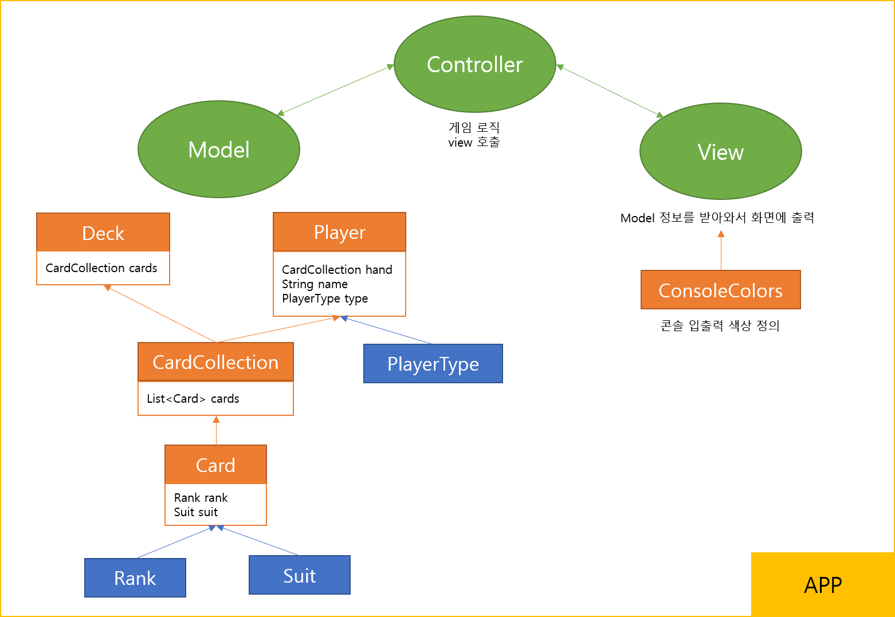
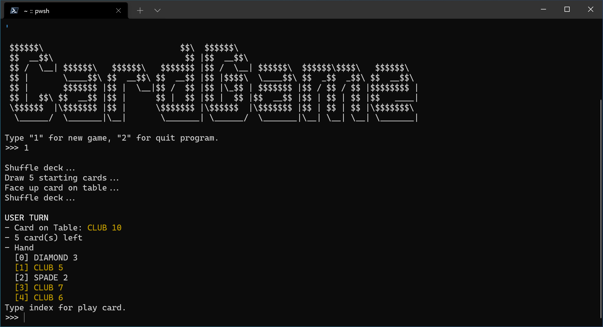
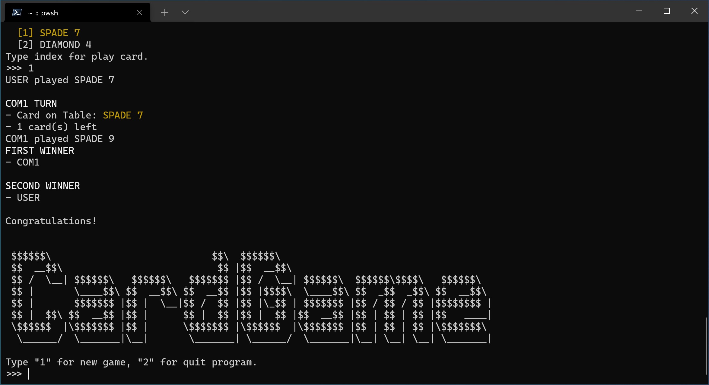

# Problem 2

2 ~ 10과 4개의 문양(스페이드, 다이아, 하트, 클로버)으로 구성된 카드를 이용해 간단한 카드 게임을 만들려고 합니다. 게임은 총 3명이서 진행이 되며 Player와 Com1, Com2 이렇게 3명의 유저가 존재합니다. 게임의 기능은 1. 게임시작, 2. 게임 종료 가 존재하며 게임이 시작하고 끝난 경우 다시 게임을 시작하거나 종료할 수 있습니다. (게임 도중 종료 및 시작 불가능)

1. 3명의 User(Player, Com1, Com2)는 게임 시작시 랜덤으로 카드 5장씩을 받고 남아있는 카드의 순서를 섞어야 합니다.
2. 카드 배분이 끝난 후 남아있는 카드의 맨 첫번째 카드를 공개합니다.
3. Player, Com1, Com2의 순서로 바닥에 공개되어 있는 카드와 숫자가 일치하거나 모양이 같은 카드를 낼 수 있고 카드를 낸 후 바닥에 공개되어있는 카드는 User가 낸 카드로 변경이 됩니다. 낼 수 있는 카드가 없는 경우 남아있는 카드 맨 끝에서부터 카드를 한장씩 가져옵니다. [카드를 가져오는 경우는 가지고 있는 카드 중 낼 수 있는 카드가 없을 때만 가능하며 낼 수 있는 카드가 여러 장일 경우 선택할 수 있어야 한다, Player만 컨트롤 할 수 있고 나머지 Com1, Com2는 적절한 규칙을 줘서 자동으로 플레이가 되도록 한다]
4. User중에 먼저 카드가 없어진 사람이 1등이 되며 그 다음으로 카드가 적은 사람이 2등으로 순위[남아있는 카드가 같을 경우 같은 순위가 매겨짐]가 매겨진다.

## Comment

### 임의로 구현한 부분

- 문제의 User(Player, Com1, Com2)는 문맥상 Player가 더 상위 개념이고, User, Com1, Com2은 구체적인 개념이 맞는 것 같다고 생각해서 이름을 바꾸어 구현했다.
- `User`의 경우 낼 수 있는 카드가 2장 이상인 경우 `index`를 통해서 선택해서 낼 수 있도록 구현했다. 이 때 프롬프트에서 손의 카드를 보여주고, 바닥에 공개되어 있는 카드와 비교해서 낼 수 있는 카드의 경우 노란색으로 표시한다. 그리고 낼 수 있는 카드의 `index`가 아니면 계속해서 입력을 받도록 예외 처리를 했다.
- 위의 경우 외에는 모두 자동으로 플레이 되도록 구현했고, 턴마다 1초의 간격을 두어 진행 상황을 볼 수 있게 했다.
- `Com`의 경우 낼 수 있는 카드 중 랜덤으로 내도록 구현했다.
- 깔끔한 코드를 위해 MVC 패턴을 일부 차용했다. 아래는 간단한 구조도다.

### 실행 화면

